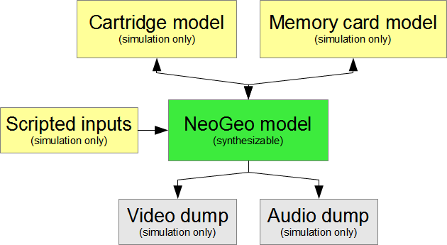

# NeoGeoFPGA-sim
Simulation project for a NeoGeo hardware definition. This does not go in a FPGA yet :)

This is being made possible by neogeodev contributors cited in neogeo_mvs.v and Patreon donators: **Marshall H. (Retroactive), Valérianne Lagrange, Mahen, Ange Albertini, Cyrille Jouineau, Artemio Urbina, Charly, Alexis Bezverkhyy**.

Green is what this project is all about. Yellow is simulation/testbench files. Grey are results from simulation.

Converted ROM files for the cartridge model initialization aren't provided for obvious reasons, get them from any ROM download website and convert them with rom2verilog.c. I'm using joyjoy (Joy Joy Kid AKA Puzzled) for now since it's a small, simple game.

Top file is neogeo_mvs.v, currently used testbench is testbench_1.v .

Yellow are RAMs, orange are possibly copyrighted ROMs, blue will be interfaces to external chips, purple are cores I didn't write, white are disabled modules in MVS mode.

# Cartridge model (MVS for now)

* cha_board.v : MVS cartridge model CHA board (C ROMs, S ROM, M ROM)
 * rom_c1.v : Sprite graphics ROM
 * rom_c2.v : Sprite graphics ROM
 * rom_s1.v : Fix graphics ROM
 * rom_m1.v : Z80 program ROM
 * neo_273.v : SNK latch chip
 * zmc.v : Z80 Memory Controller part (can be part of ZMC2)
* prog_board.v : MVS cartridge model PROG board (V ROMs, P ROM)
 * rom_p1.v : 68k program ROM
 * rom_v1.v : Sound ROM
 * rom_v2.v : Sound ROM
* mvs_cart.v : Just wires both CHA and PROG boards into a cartridge model

# Memory card model

* memcard.v : Just some RAM :)

# NeoGeo model

* cpu_68k.v : Wrapper for ao68000, exposing real 68k connections
 * ao68000.v : ao68000 Motorola 68000 CPU core (https://github.com/alfikpl/ao68000)
* m68kram.v : 68k work RAM helper
 * ram68k_l.v : 68k work RAM LSBs
 * ram68k_u.v : 68k work RAM MSBs
* bram.v : Backup RAM (MVS) helper
 * bram_l.v : Backup RAM LSBs
 * bram_u.v : Backup RAM MSBs
* palram.v : Palette RAM helper
 * palram_l.v : Palette RAM LSBs
 * palram_u.v : Palette RAM MSBs
* zram.v : Z80 work RAM
* upd4990.v : NEC uPD4990 interface to some modern compatible RTC chip
* neo_zmc2.v : SNK graphics chip (most of it done by Kyuusaku)
 * zmc2_dot.v : Graphics serializer part
* neo_c1.v : SNK address decoding, joypad inputs, system maestro chip
 * c1_regs.v : On-chip registers
 * c1_wait.v : Wait state generator
* neo_d0.v : SNK memory card, clock and joypad outputs chip
 * clocks.v : Clock divider
 * z80ctrl.v : Z80 controller
* neo_f0.v : SNK MVS cab I/O chip
* lspc_a2.v : Where the magic lives
 * irq.v : 68000 IRQ gen/ack
 * videosync.v : Video sync and "ticks" generator
 * slow_cycle.v : Slow VRAM access sequencer
  * vram_slow_l.v : Slow VRAM chip LSBs
  * vram_slow_u.v : Slow VRAM chip MSBs
 * fast_cycle.v : Fast VRAM access sequencer
  * vram_fast_l.v : Fast VRAM chip LSBs
  * vram_fast_u.v : Fast VRAM chip MSBs
 * p_cycle.v : P bus sequencer
 * autoanim.v : Auto-animation specifics
 * hshrink.v : Sprite horizontal shrink logic
* neo_b1.v : SNK graphics buffer chip
 * watchdog.v : Watchdog timer part
 * linebuffer.v : Pixel line buffers (x4)
* neo_i0.v : SNK MVS cab I/O chip
* syslatch.v : System latch/register
* rom_l0.v : Shrink lookup table (L0) ROM
* rom_sp.v : System program (SP-S2 BIOS) ROM
* rom_sfix.v : Embeded fix graphics (SFIX) ROM
* bram.v : Backup RAM
 * bram_l.v : Backup RAM low
 * bram_u.v : Backup RAM high
* palram_l.v : Palette RAM LSB
* palram_u.v : Palette RAM MSB
* videout.v : Video output latch
* ym2610.v : Yamaha YM2610 sound chip
 * ym_timer.v : Timer and IRQ part
 * ym_ssg.v : Simple Sound Generator part
 * ym_pcma.v : ADPCM-A voices part
 * ym_pcmb.v : ADPCM-B voice part
